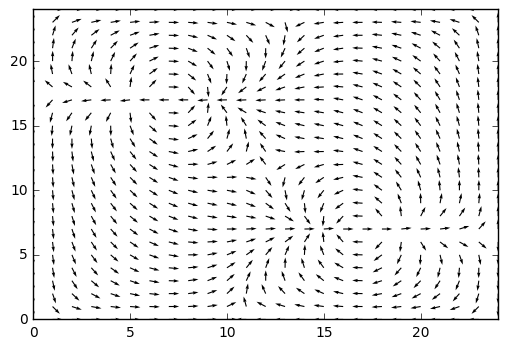
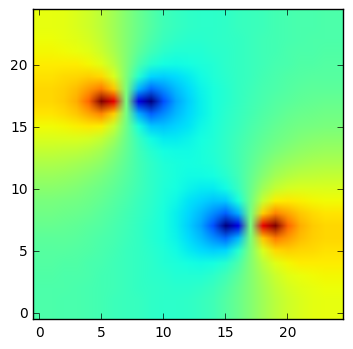

```python
from project import getPoissonMatrix, pressure_solve
import numpy as np
import matplotlib.pyplot as plt

n = 25
U = np.zeros((n,n), dtype=np.float)
V = np.zeros((n,n))
U.itemset((n//2-5,n//2+5), 10)
U.itemset((n//2-5,n//2+6), 10)
U.itemset((n//2-5,n//2+4), 10)

U.itemset((n//2+5,n//2-5), -10)
U.itemset((n//2+5,n//2-4), -10)
U.itemset((n//2+5,n//2-6), -10)

M = getPoissonMatrix(n-2)
    
U, V, P = pressure_solve(U, V, M)

speed = np.sqrt(U**2 + V**2)
UN = U/speed
VN = V/speed

#xc = np.arange(0,n)
plot2 = plt.figure()
plt.quiver(UN,VN)
plt.axis((0,n-1,0,n-1))
plt.show(plot2)

plot3 = plt.imshow(P, origin='lower')
plt.show(plot3)
```

    /usr/lib/python3.5/site-packages/ipykernel/__main__.py:21: RuntimeWarning: invalid value encountered in true_divide
    /usr/lib/python3.5/site-packages/ipykernel/__main__.py:22: RuntimeWarning: invalid value encountered in true_divide







